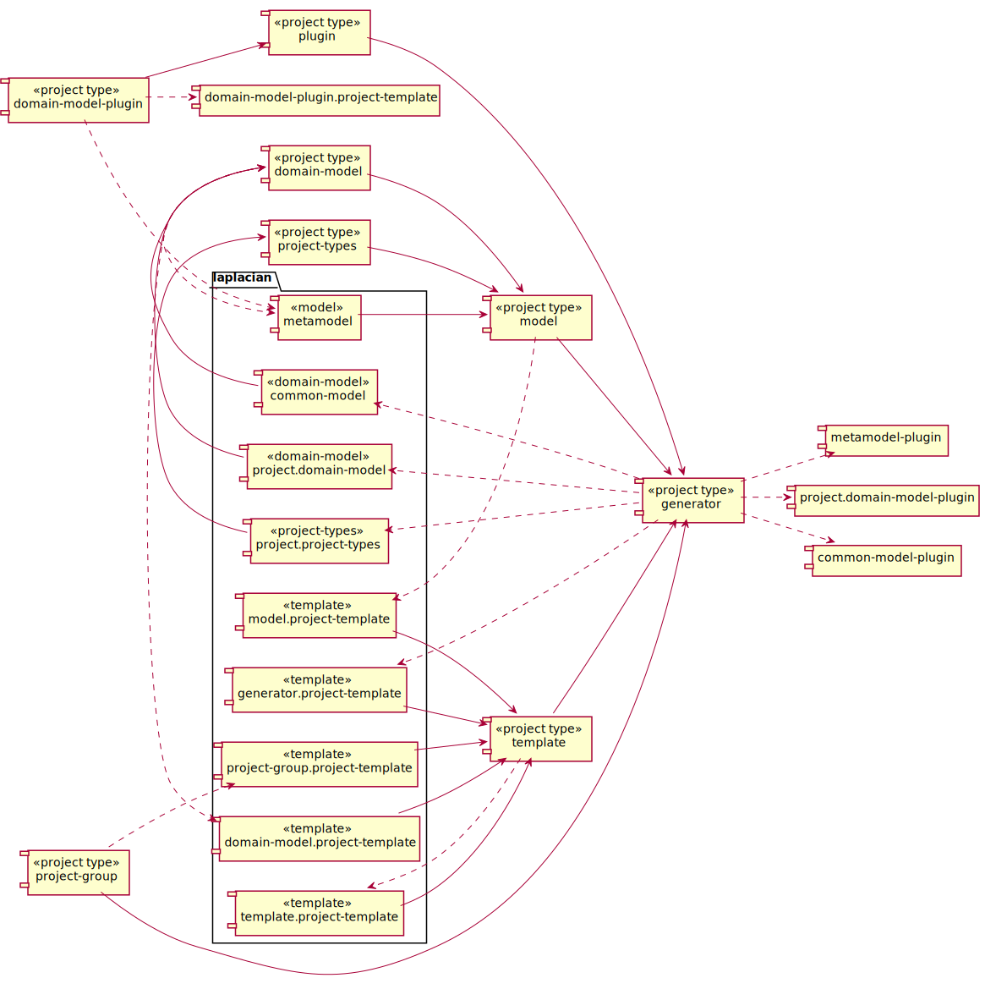

<!-- @head-content@ -->
# laplacian/projects

The core modules for the Laplacian generator.


*Read this in other languages*: [[日本語](README_ja.md)] [[简体中文](README_zh.md)]
<!-- @head-content@ -->

<!-- @toc@ -->
## Table of contents
- [Overview](#overview)

  * [Project dependencies](#project-dependencies)

- [Usage](#usage)

- [Index](#index)

  * [Project list](#project-list)

  * [Script List](#script-list)

  * [Source code list](#source-code-list)


<!-- @toc@ -->

<!-- @main-content@ -->
## Overview


### Project dependencies


The following graph shows the dependencies between each project.


## Usage

To apply this Model module, add the following entry to your project definition.
```yaml
project:
  models:
  - group: laplacian
    name: projects
    version: 1.0.0
```

You can run the following command to see a list of resources affected by the application of this module and their contents.
```console
$ ./script/generate --dry-run

diff --color -r PROJECT_HOME/.NEXT/somewhere/something.md PROJECT_HOME/somewhere/something.md
1,26c1,10
< content: OLD CONTENT
---
> content: NEW CONTENT
```

If there is no problem, execute the following command to reflect the change.
```console
$ ./script/generate

```


## Index


### Project list


- [**laplacian-arch/architecture-document-template**](<https://github.com/nabla-squared/laplacian-arch.architecture-document-template.git>)

> This template generates a set of documentation of the system architecture defined by the `laplacian-arch` model.
> 
- [**laplacian-arch/datasource.flyway-migration-template**](<https://github.com/nabla-squared/laplacian-arch.datasource.flyway-migration-template.git>)

> This template generates [flyway](https://flywaydb.org/) database schema migration tasks from datasource models.
> 
- [**laplacian-arch/datasource.schema-model**](<https://github.com/nabla-squared/laplacian-arch.model.datasource.git>)

> This model expresses a view of a data-store (ex:RDBMS, KVS, etc..) from a certain client This model consists of the following entities:
> - The information which is necessary to connect the data-store
> - The entities allowed for clients to access
> - The queries issued by the client
> 
- [**laplacian-arch/datasource.schema-plugin**](<>)

> A schema gradle plugin for the datasource arch model
> 
- [**laplacian-arch/service-api.schema-model**](<https://github.com/nabla-squared/laplacian-arch.service-api-schema-model.git>)

> A model that expresses the logical structure of a service API.
> This model consists of REST api model, GraphQL interface model, and datasource usage model.
> 
- [**laplacian-arch/service-api.schema-plugin**](<>)

> A schema for service-api architecture model.
> 
- [**laplacian-arch/service-api.springboot2-template**](<https://github.com/nabla-squared/laplacian-arch.service-api.springboot2-template.git>)

> This template gives a service api implementation based on the [service-api](https://github.com/nabla-squared/laplacian-arch.service-api.schema-model/) model.
> The architecture stack which is employed in this template is:
>   - Alpine based docker image
>   - OpenJDK8
>   - SpringBoot 2
>   - Java-Graphql
> 
- [**laplacian/common-model-plugin**](<>)

> Plugin module for the laplacian common model.
> 
- [**laplacian/common-model**](<https://github.com/nabla-squared/laplacian.common-model.git>)

> Some value objects and mixins which can be applicable to any domain models.
> 
- [**laplacian/domain-model-plugin.project-template**](<https://github.com/nabla-squared/laplacian.domain-model-plugin.project-template.git>)

> A template for a domain model plugin project.
> 
- [**laplacian/domain-model.project-template**](<https://github.com/nabla-squared/laplacian.domain-model.project-template.git>)

> This is a template module that generates directory structure, development scripts, and relating documents for a domain model project.
> 
- [**laplacian/generator.project-template**](<https://github.com/nabla-squared/laplacian.generator.project-template.git>)

> This template module generates the standard directory structure and common scripts
> for building and publishing to local repositories in a Laplacian project.
> 
- [**laplacian/metamodel-plugin**](<>)

> A model which expresses the logical structure of laplacian-based projects and modules.
> 
- [**laplacian/metamodel**](<https://github.com/nabla-squared/laplacian.metamodel.git>)

> A model that expresses the structure of relational model with aggregation support.
> This model is used to define models from which templates generate resources such as source code or document.
> 
- [**laplacian/project-group.document-template**](<https://github.com/nabla-squared/laplacian.project-group.document-template.git>)

> A template to generate documentation about a project group.
> 
- [**laplacian/project.domain-model**](<https://github.com/nabla-squared/laplacian.project.domain-model.git>)

> This model represents the logical structure of a *Laplacian*-based project.
> 
- [**laplacian/project.project-types**](<https://github.com/nabla-squared/laplacian.project.project-types.git>)

> The basic project types used in the Laplacian project.
> 
### Script List


- [./script/do-each-subproject.sh](<./scripts/do-each-subproject.sh>)

  Executes the command specified by the argument for each subproject.

  Example:
  ```console
  $ ./scripts/null -c git status
  ```

  > Usage: do-each-subproject.sh [OPTION]...
  >
  > -h, --help
  >
  >   Displays how to use this command.
  >   
  > -v, --verbose
  >
  >   Displays more detailed command execution information.
  >   
  > -c, --continue-on-error
  >
  >   Even if the given command fails in a subproject in the middle, executes it for the remaining subprojects.
  >   
- [./script/generate-all.sh](<./scripts/generate-all.sh>)

  Generates resources in the project, including subprojects.

  > Usage: generate-all.sh [OPTION]...
  >
  > -h, --help
  >
  >   Displays how to use this command.
  >   
  > -v, --verbose
  >
  >   Displays more detailed command execution information.
  >   
  > -c, --continue-on-error
  >
  >   Even if the given command fails in a subproject in the middle, executes it for the remaining subprojects.
  >   
- [./script/generate-laplacian-arch-architecture-document-template.sh](<./scripts/generate-laplacian-arch-architecture-document-template.sh>)

  Generates the [laplacian-arch/architecture-document-template](<https://github.com/nabla-squared/laplacian-arch.architecture-document-template.git>) project as a subproject in the following directory.
  ```
  subprojects/laplacian-arch.architecture-document-template
  ```
  If the subproject already exists, the content of the subproject is updated.

  > Usage: generate-laplacian-arch-architecture-document-template.sh [OPTION]...
  >
  > -h, --help
  >
  >   Displays how to use this command.
  >   
  > -v, --verbose
  >
  >   Displays more detailed command execution information.
  >   
  > -c, --clean
  >
  >   Delete all local resources of the subproject and regenerate them.
  >   
- [./script/generate-laplacian-arch-datasource-flyway-migration-template.sh](<./scripts/generate-laplacian-arch-datasource-flyway-migration-template.sh>)

  Generates the [laplacian-arch/datasource.flyway-migration-template](<https://github.com/nabla-squared/laplacian-arch.datasource.flyway-migration-template.git>) project as a subproject in the following directory.
  ```
  subprojects/laplacian-arch.datasource.flyway-migration-template
  ```
  If the subproject already exists, the content of the subproject is updated.

  > Usage: generate-laplacian-arch-datasource-flyway-migration-template.sh [OPTION]...
  >
  > -h, --help
  >
  >   Displays how to use this command.
  >   
  > -v, --verbose
  >
  >   Displays more detailed command execution information.
  >   
  > -c, --clean
  >
  >   Delete all local resources of the subproject and regenerate them.
  >   
- [./script/generate-laplacian-arch-datasource-schema-model.sh](<./scripts/generate-laplacian-arch-datasource-schema-model.sh>)

  Generates the [laplacian-arch/datasource.schema-model](<https://github.com/nabla-squared/laplacian-arch.model.datasource.git>) project as a subproject in the following directory.
  ```
  subprojects/laplacian-arch.datasource.schema-model
  ```
  If the subproject already exists, the content of the subproject is updated.

  > Usage: generate-laplacian-arch-datasource-schema-model.sh [OPTION]...
  >
  > -h, --help
  >
  >   Displays how to use this command.
  >   
  > -v, --verbose
  >
  >   Displays more detailed command execution information.
  >   
  > -c, --clean
  >
  >   Delete all local resources of the subproject and regenerate them.
  >   
- [./script/generate-laplacian-arch-datasource-schema-plugin.sh](<./scripts/generate-laplacian-arch-datasource-schema-plugin.sh>)

  Generates the [laplacian-arch/datasource.schema-plugin](<null>) project as a subproject in the following directory.
  ```
  subprojects/laplacian-arch.datasource.schema-plugin
  ```
  If the subproject already exists, the content of the subproject is updated.

  > Usage: generate-laplacian-arch-datasource-schema-plugin.sh [OPTION]...
  >
  > -h, --help
  >
  >   Displays how to use this command.
  >   
  > -v, --verbose
  >
  >   Displays more detailed command execution information.
  >   
  > -c, --clean
  >
  >   Delete all local resources of the subproject and regenerate them.
  >   
- [./script/generate-laplacian-arch-service-api-schema-model.sh](<./scripts/generate-laplacian-arch-service-api-schema-model.sh>)

  Generates the [laplacian-arch/service-api.schema-model](<https://github.com/nabla-squared/laplacian-arch.service-api-schema-model.git>) project as a subproject in the following directory.
  ```
  subprojects/laplacian-arch.service-api.schema-model
  ```
  If the subproject already exists, the content of the subproject is updated.

  > Usage: generate-laplacian-arch-service-api-schema-model.sh [OPTION]...
  >
  > -h, --help
  >
  >   Displays how to use this command.
  >   
  > -v, --verbose
  >
  >   Displays more detailed command execution information.
  >   
  > -c, --clean
  >
  >   Delete all local resources of the subproject and regenerate them.
  >   
- [./script/generate-laplacian-arch-service-api-schema-plugin.sh](<./scripts/generate-laplacian-arch-service-api-schema-plugin.sh>)

  Generates the [laplacian-arch/service-api.schema-plugin](<null>) project as a subproject in the following directory.
  ```
  subprojects/laplacian-arch.service-api.schema-plugin
  ```
  If the subproject already exists, the content of the subproject is updated.

  > Usage: generate-laplacian-arch-service-api-schema-plugin.sh [OPTION]...
  >
  > -h, --help
  >
  >   Displays how to use this command.
  >   
  > -v, --verbose
  >
  >   Displays more detailed command execution information.
  >   
  > -c, --clean
  >
  >   Delete all local resources of the subproject and regenerate them.
  >   
- [./script/generate-laplacian-arch-service-api-springboot2-template.sh](<./scripts/generate-laplacian-arch-service-api-springboot2-template.sh>)

  Generates the [laplacian-arch/service-api.springboot2-template](<https://github.com/nabla-squared/laplacian-arch.service-api.springboot2-template.git>) project as a subproject in the following directory.
  ```
  subprojects/laplacian-arch.service-api.springboot2-template
  ```
  If the subproject already exists, the content of the subproject is updated.

  > Usage: generate-laplacian-arch-service-api-springboot2-template.sh [OPTION]...
  >
  > -h, --help
  >
  >   Displays how to use this command.
  >   
  > -v, --verbose
  >
  >   Displays more detailed command execution information.
  >   
  > -c, --clean
  >
  >   Delete all local resources of the subproject and regenerate them.
  >   
- [./script/generate-laplacian-common-model-plugin.sh](<./scripts/generate-laplacian-common-model-plugin.sh>)

  Generates the [laplacian/common-model-plugin](<null>) project as a subproject in the following directory.
  ```
  subprojects/laplacian.common-model-plugin
  ```
  If the subproject already exists, the content of the subproject is updated.

  > Usage: generate-laplacian-common-model-plugin.sh [OPTION]...
  >
  > -h, --help
  >
  >   Displays how to use this command.
  >   
  > -v, --verbose
  >
  >   Displays more detailed command execution information.
  >   
  > -c, --clean
  >
  >   Delete all local resources of the subproject and regenerate them.
  >   
- [./script/generate-laplacian-common-model.sh](<./scripts/generate-laplacian-common-model.sh>)

  Generates the [laplacian/common-model](<https://github.com/nabla-squared/laplacian.common-model.git>) project as a subproject in the following directory.
  ```
  subprojects/laplacian.common-model
  ```
  If the subproject already exists, the content of the subproject is updated.

  > Usage: generate-laplacian-common-model.sh [OPTION]...
  >
  > -h, --help
  >
  >   Displays how to use this command.
  >   
  > -v, --verbose
  >
  >   Displays more detailed command execution information.
  >   
  > -c, --clean
  >
  >   Delete all local resources of the subproject and regenerate them.
  >   
- [./script/generate-laplacian-domain-model-plugin-project-template.sh](<./scripts/generate-laplacian-domain-model-plugin-project-template.sh>)

  Generates the [laplacian/domain-model-plugin.project-template](<https://github.com/nabla-squared/laplacian.domain-model-plugin.project-template.git>) project as a subproject in the following directory.
  ```
  subprojects/laplacian.domain-model-plugin.project-template
  ```
  If the subproject already exists, the content of the subproject is updated.

  > Usage: generate-laplacian-domain-model-plugin-project-template.sh [OPTION]...
  >
  > -h, --help
  >
  >   Displays how to use this command.
  >   
  > -v, --verbose
  >
  >   Displays more detailed command execution information.
  >   
  > -c, --clean
  >
  >   Delete all local resources of the subproject and regenerate them.
  >   
- [./script/generate-laplacian-domain-model-project-template.sh](<./scripts/generate-laplacian-domain-model-project-template.sh>)

  Generates the [laplacian/domain-model.project-template](<https://github.com/nabla-squared/laplacian.domain-model.project-template.git>) project as a subproject in the following directory.
  ```
  subprojects/laplacian.domain-model.project-template
  ```
  If the subproject already exists, the content of the subproject is updated.

  > Usage: generate-laplacian-domain-model-project-template.sh [OPTION]...
  >
  > -h, --help
  >
  >   Displays how to use this command.
  >   
  > -v, --verbose
  >
  >   Displays more detailed command execution information.
  >   
  > -c, --clean
  >
  >   Delete all local resources of the subproject and regenerate them.
  >   
- [./script/generate-laplacian-generator-project-template.sh](<./scripts/generate-laplacian-generator-project-template.sh>)

  Generates the [laplacian/generator.project-template](<https://github.com/nabla-squared/laplacian.generator.project-template.git>) project as a subproject in the following directory.
  ```
  subprojects/laplacian.generator.project-template
  ```
  If the subproject already exists, the content of the subproject is updated.

  > Usage: generate-laplacian-generator-project-template.sh [OPTION]...
  >
  > -h, --help
  >
  >   Displays how to use this command.
  >   
  > -v, --verbose
  >
  >   Displays more detailed command execution information.
  >   
  > -c, --clean
  >
  >   Delete all local resources of the subproject and regenerate them.
  >   
- [./script/generate-laplacian-metamodel-plugin.sh](<./scripts/generate-laplacian-metamodel-plugin.sh>)

  Generates the [laplacian/metamodel-plugin](<null>) project as a subproject in the following directory.
  ```
  subprojects/laplacian.metamodel-plugin
  ```
  If the subproject already exists, the content of the subproject is updated.

  > Usage: generate-laplacian-metamodel-plugin.sh [OPTION]...
  >
  > -h, --help
  >
  >   Displays how to use this command.
  >   
  > -v, --verbose
  >
  >   Displays more detailed command execution information.
  >   
  > -c, --clean
  >
  >   Delete all local resources of the subproject and regenerate them.
  >   
- [./script/generate-laplacian-metamodel.sh](<./scripts/generate-laplacian-metamodel.sh>)

  Generates the [laplacian/metamodel](<https://github.com/nabla-squared/laplacian.metamodel.git>) project as a subproject in the following directory.
  ```
  subprojects/laplacian.metamodel
  ```
  If the subproject already exists, the content of the subproject is updated.

  > Usage: generate-laplacian-metamodel.sh [OPTION]...
  >
  > -h, --help
  >
  >   Displays how to use this command.
  >   
  > -v, --verbose
  >
  >   Displays more detailed command execution information.
  >   
  > -c, --clean
  >
  >   Delete all local resources of the subproject and regenerate them.
  >   
- [./script/generate-laplacian-project-domain-model.sh](<./scripts/generate-laplacian-project-domain-model.sh>)

  Generates the [laplacian/project.domain-model](<https://github.com/nabla-squared/laplacian.project.domain-model.git>) project as a subproject in the following directory.
  ```
  subprojects/laplacian.project.domain-model
  ```
  If the subproject already exists, the content of the subproject is updated.

  > Usage: generate-laplacian-project-domain-model.sh [OPTION]...
  >
  > -h, --help
  >
  >   Displays how to use this command.
  >   
  > -v, --verbose
  >
  >   Displays more detailed command execution information.
  >   
  > -c, --clean
  >
  >   Delete all local resources of the subproject and regenerate them.
  >   
- [./script/generate-laplacian-project-group-document-template.sh](<./scripts/generate-laplacian-project-group-document-template.sh>)

  Generates the [laplacian/project-group.document-template](<https://github.com/nabla-squared/laplacian.project-group.document-template.git>) project as a subproject in the following directory.
  ```
  subprojects/laplacian.project-group.document-template
  ```
  If the subproject already exists, the content of the subproject is updated.

  > Usage: generate-laplacian-project-group-document-template.sh [OPTION]...
  >
  > -h, --help
  >
  >   Displays how to use this command.
  >   
  > -v, --verbose
  >
  >   Displays more detailed command execution information.
  >   
  > -c, --clean
  >
  >   Delete all local resources of the subproject and regenerate them.
  >   
- [./script/generate-laplacian-project-project-types.sh](<./scripts/generate-laplacian-project-project-types.sh>)

  Generates the [laplacian/project.project-types](<https://github.com/nabla-squared/laplacian.project.project-types.git>) project as a subproject in the following directory.
  ```
  subprojects/laplacian.project.project-types
  ```
  If the subproject already exists, the content of the subproject is updated.

  > Usage: generate-laplacian-project-project-types.sh [OPTION]...
  >
  > -h, --help
  >
  >   Displays how to use this command.
  >   
  > -v, --verbose
  >
  >   Displays more detailed command execution information.
  >   
  > -c, --clean
  >
  >   Delete all local resources of the subproject and regenerate them.
  >   
- [./script/generate.sh](<./scripts/generate.sh>)

  Generates the resources in each directory of `src/` `model/` `template/` in this project.
  The results are reflected in each directory of `dest/` `doc/` `script/`.

  *Generator input files*

  - `src/`
    Stores static resources that are not processed the generator.
    The contents of this directory are copied directly into the `dest/` directory.

  - `model/`
    Stores the static model data files written in *YAML* or *JSON* format used for the generation.

  - `template/`
    This directory contains the template files used for the generation.
    Files with a extension `.hbs` will be handled as templates. All other files are copied as is.

    - `template/dest` `template/doc` `template/scripts`
      Each of these directories contains the template files of the resource to be output
      in the directory `dest/` `doc/` `scripts`.

    - `template/model` `template/template`
      These directories store template files updating the contents of `template/` and `model/` used for the generation.
      If the content of `template/` `model/` is updated as a result of the generation,
      the generation process is executed recursively.
      The changes to `template/` `model/` that occur during the above process are treated as an intermediate state
      and will be lost after the completion of the process.
      Use the *--dry-run* option to check these intermediate files.

  *Generator output files*

  - `dest/`
    Outputs the source files of applications and modules created as the result of
    the generation process.

  - `doc/`
    Outputs the project documentation.

  - `scripts/`
    Outputs various scripts used in development and operation.

  > Usage: generate.sh [OPTION]...
  >
  > -h, --help
  >
  >   Displays how to use this command.
  >   
  > -v, --verbose
  >
  >   Displays more detailed command execution information.
  >   
  > -d, --dry-run
  >
  >   After this command is processed, the generated files are output to the `.NEXT` directory
  >   without reflecting to the folders of `dest/` `doc/` `scripts/`.
  >   In addition, the difference between the contents of the `.NEXT` directory and the current files.
  >   This directory also contains any intermediate files created during the generation.
  >   
  > -r, --max-recursion [VALUE]
  >
  >   The upper limit of the number of times to execute recursively
  >   when the contents of the `model/` `template/` directory are updated
  >   during the generation process.
  >    (Default: 10)
- [./script/git-each-subproject.sh](<./scripts/git-each-subproject.sh>)

  Executes the git sub-command specified by the argument for each subproject.

  Example:
  ```console
  $ ./scripts/null -c status
  ```

  > Usage: git-each-subproject.sh [OPTION]...
  >
  > -h, --help
  >
  >   Displays how to use this command.
  >   
  > -v, --verbose
  >
  >   Displays more detailed command execution information.
  >   
  > -c, --continue-on-error
  >
  >   Even if the given command fails in a subproject in the middle, executes it for the remaining subprojects.
  >   
- [./script/publish-local.sh](<./scripts/publish-local.sh>)

  After the resources in the project are generated,
  the resources in the `./dest` directory are built as a model module
  and registered in the local repository.

  > Usage: publish-local.sh [OPTION]...
  >
  > -h, --help
  >
  >   Displays how to use this command.
  >   
  > -v, --verbose
  >
  >   Displays more detailed command execution information.
  >   
  > -r, --max-recursion [VALUE]
  >
  >   This option is the same as the option of the same name in [generate.sh](<./scripts/generate.sh>).
  >    (Default: 10)
  > , --skip-generation
  >
  >   This option is the same as the option of the same name in [generate.sh](<./scripts/generate.sh>).
  >   
- [./script/publish-local-laplacian-arch-architecture-document-template.sh](<./scripts/publish-local-laplacian-arch-architecture-document-template.sh>)

  Generates resources for the [laplacian-arch/architecture-document-template](<https://github.com/nabla-squared/laplacian-arch.architecture-document-template.git>) subproject.

  > Usage: publish-local-laplacian-arch-architecture-document-template.sh [OPTION]...
  >
  > -h, --help
  >
  >   Displays how to use this command.
  >   
  > -v, --verbose
  >
  >   Displays more detailed command execution information.
  >   
- [./script/publish-local-laplacian-arch-datasource-flyway-migration-template.sh](<./scripts/publish-local-laplacian-arch-datasource-flyway-migration-template.sh>)

  Generates resources for the [laplacian-arch/datasource.flyway-migration-template](<https://github.com/nabla-squared/laplacian-arch.datasource.flyway-migration-template.git>) subproject.

  > Usage: publish-local-laplacian-arch-datasource-flyway-migration-template.sh [OPTION]...
  >
  > -h, --help
  >
  >   Displays how to use this command.
  >   
  > -v, --verbose
  >
  >   Displays more detailed command execution information.
  >   
- [./script/publish-local-laplacian-arch-datasource-schema-model.sh](<./scripts/publish-local-laplacian-arch-datasource-schema-model.sh>)

  Generates resources for the [laplacian-arch/datasource.schema-model](<https://github.com/nabla-squared/laplacian-arch.model.datasource.git>) subproject.

  > Usage: publish-local-laplacian-arch-datasource-schema-model.sh [OPTION]...
  >
  > -h, --help
  >
  >   Displays how to use this command.
  >   
  > -v, --verbose
  >
  >   Displays more detailed command execution information.
  >   
- [./script/publish-local-laplacian-arch-datasource-schema-plugin.sh](<./scripts/publish-local-laplacian-arch-datasource-schema-plugin.sh>)

  Generates resources for the [laplacian-arch/datasource.schema-plugin](<null>) subproject.

  > Usage: publish-local-laplacian-arch-datasource-schema-plugin.sh [OPTION]...
  >
  > -h, --help
  >
  >   Displays how to use this command.
  >   
  > -v, --verbose
  >
  >   Displays more detailed command execution information.
  >   
- [./script/publish-local-laplacian-arch-service-api-schema-model.sh](<./scripts/publish-local-laplacian-arch-service-api-schema-model.sh>)

  Generates resources for the [laplacian-arch/service-api.schema-model](<https://github.com/nabla-squared/laplacian-arch.service-api-schema-model.git>) subproject.

  > Usage: publish-local-laplacian-arch-service-api-schema-model.sh [OPTION]...
  >
  > -h, --help
  >
  >   Displays how to use this command.
  >   
  > -v, --verbose
  >
  >   Displays more detailed command execution information.
  >   
- [./script/publish-local-laplacian-arch-service-api-schema-plugin.sh](<./scripts/publish-local-laplacian-arch-service-api-schema-plugin.sh>)

  Generates resources for the [laplacian-arch/service-api.schema-plugin](<null>) subproject.

  > Usage: publish-local-laplacian-arch-service-api-schema-plugin.sh [OPTION]...
  >
  > -h, --help
  >
  >   Displays how to use this command.
  >   
  > -v, --verbose
  >
  >   Displays more detailed command execution information.
  >   
- [./script/publish-local-laplacian-arch-service-api-springboot2-template.sh](<./scripts/publish-local-laplacian-arch-service-api-springboot2-template.sh>)

  Generates resources for the [laplacian-arch/service-api.springboot2-template](<https://github.com/nabla-squared/laplacian-arch.service-api.springboot2-template.git>) subproject.

  > Usage: publish-local-laplacian-arch-service-api-springboot2-template.sh [OPTION]...
  >
  > -h, --help
  >
  >   Displays how to use this command.
  >   
  > -v, --verbose
  >
  >   Displays more detailed command execution information.
  >   
- [./script/publish-local-laplacian-common-model-plugin.sh](<./scripts/publish-local-laplacian-common-model-plugin.sh>)

  Generates resources for the [laplacian/common-model-plugin](<null>) subproject.

  > Usage: publish-local-laplacian-common-model-plugin.sh [OPTION]...
  >
  > -h, --help
  >
  >   Displays how to use this command.
  >   
  > -v, --verbose
  >
  >   Displays more detailed command execution information.
  >   
- [./script/publish-local-laplacian-common-model.sh](<./scripts/publish-local-laplacian-common-model.sh>)

  Generates resources for the [laplacian/common-model](<https://github.com/nabla-squared/laplacian.common-model.git>) subproject.

  > Usage: publish-local-laplacian-common-model.sh [OPTION]...
  >
  > -h, --help
  >
  >   Displays how to use this command.
  >   
  > -v, --verbose
  >
  >   Displays more detailed command execution information.
  >   
- [./script/publish-local-laplacian-domain-model-plugin-project-template.sh](<./scripts/publish-local-laplacian-domain-model-plugin-project-template.sh>)

  Generates resources for the [laplacian/domain-model-plugin.project-template](<https://github.com/nabla-squared/laplacian.domain-model-plugin.project-template.git>) subproject.

  > Usage: publish-local-laplacian-domain-model-plugin-project-template.sh [OPTION]...
  >
  > -h, --help
  >
  >   Displays how to use this command.
  >   
  > -v, --verbose
  >
  >   Displays more detailed command execution information.
  >   
- [./script/publish-local-laplacian-domain-model-project-template.sh](<./scripts/publish-local-laplacian-domain-model-project-template.sh>)

  Generates resources for the [laplacian/domain-model.project-template](<https://github.com/nabla-squared/laplacian.domain-model.project-template.git>) subproject.

  > Usage: publish-local-laplacian-domain-model-project-template.sh [OPTION]...
  >
  > -h, --help
  >
  >   Displays how to use this command.
  >   
  > -v, --verbose
  >
  >   Displays more detailed command execution information.
  >   
- [./script/publish-local-laplacian-generator-project-template.sh](<./scripts/publish-local-laplacian-generator-project-template.sh>)

  Generates resources for the [laplacian/generator.project-template](<https://github.com/nabla-squared/laplacian.generator.project-template.git>) subproject.

  > Usage: publish-local-laplacian-generator-project-template.sh [OPTION]...
  >
  > -h, --help
  >
  >   Displays how to use this command.
  >   
  > -v, --verbose
  >
  >   Displays more detailed command execution information.
  >   
- [./script/publish-local-laplacian-metamodel-plugin.sh](<./scripts/publish-local-laplacian-metamodel-plugin.sh>)

  Generates resources for the [laplacian/metamodel-plugin](<null>) subproject.

  > Usage: publish-local-laplacian-metamodel-plugin.sh [OPTION]...
  >
  > -h, --help
  >
  >   Displays how to use this command.
  >   
  > -v, --verbose
  >
  >   Displays more detailed command execution information.
  >   
- [./script/publish-local-laplacian-metamodel.sh](<./scripts/publish-local-laplacian-metamodel.sh>)

  Generates resources for the [laplacian/metamodel](<https://github.com/nabla-squared/laplacian.metamodel.git>) subproject.

  > Usage: publish-local-laplacian-metamodel.sh [OPTION]...
  >
  > -h, --help
  >
  >   Displays how to use this command.
  >   
  > -v, --verbose
  >
  >   Displays more detailed command execution information.
  >   
- [./script/publish-local-laplacian-project-domain-model.sh](<./scripts/publish-local-laplacian-project-domain-model.sh>)

  Generates resources for the [laplacian/project.domain-model](<https://github.com/nabla-squared/laplacian.project.domain-model.git>) subproject.

  > Usage: publish-local-laplacian-project-domain-model.sh [OPTION]...
  >
  > -h, --help
  >
  >   Displays how to use this command.
  >   
  > -v, --verbose
  >
  >   Displays more detailed command execution information.
  >   
- [./script/publish-local-laplacian-project-group-document-template.sh](<./scripts/publish-local-laplacian-project-group-document-template.sh>)

  Generates resources for the [laplacian/project-group.document-template](<https://github.com/nabla-squared/laplacian.project-group.document-template.git>) subproject.

  > Usage: publish-local-laplacian-project-group-document-template.sh [OPTION]...
  >
  > -h, --help
  >
  >   Displays how to use this command.
  >   
  > -v, --verbose
  >
  >   Displays more detailed command execution information.
  >   
- [./script/publish-local-laplacian-project-project-types.sh](<./scripts/publish-local-laplacian-project-project-types.sh>)

  Generates resources for the [laplacian/project.project-types](<https://github.com/nabla-squared/laplacian.project.project-types.git>) subproject.

  > Usage: publish-local-laplacian-project-project-types.sh [OPTION]...
  >
  > -h, --help
  >
  >   Displays how to use this command.
  >   
  > -v, --verbose
  >
  >   Displays more detailed command execution information.
  >   
### Source code list


- [model/project.yaml](<./model/project.yaml>)
- [src/project/subprojects/laplacian-arch/laplacian-arch.architecture-document-template.yaml](<./src/project/subprojects/laplacian-arch/laplacian-arch.architecture-document-template.yaml>)
- [src/project/subprojects/laplacian-arch/laplacian-arch.datasource.flyway-migration-template.yaml](<./src/project/subprojects/laplacian-arch/laplacian-arch.datasource.flyway-migration-template.yaml>)
- [src/project/subprojects/laplacian-arch/laplacian-arch.datasource.schema-model.yaml](<./src/project/subprojects/laplacian-arch/laplacian-arch.datasource.schema-model.yaml>)
- [src/project/subprojects/laplacian-arch/laplacian-arch.datasource.schema-plugin.yaml](<./src/project/subprojects/laplacian-arch/laplacian-arch.datasource.schema-plugin.yaml>)
- [src/project/subprojects/laplacian-arch/laplacian-arch.service-api.schema-model.yaml](<./src/project/subprojects/laplacian-arch/laplacian-arch.service-api.schema-model.yaml>)
- [src/project/subprojects/laplacian-arch/laplacian-arch.service-api.schema-plugin.yaml](<./src/project/subprojects/laplacian-arch/laplacian-arch.service-api.schema-plugin.yaml>)
- [src/project/subprojects/laplacian-arch/laplacian-arch.service-api.springboot2-template.yaml](<./src/project/subprojects/laplacian-arch/laplacian-arch.service-api.springboot2-template.yaml>)
- [src/project/subprojects/laplacian/laplacian.common-model-plugin.yaml](<./src/project/subprojects/laplacian/laplacian.common-model-plugin.yaml>)
- [src/project/subprojects/laplacian/laplacian.common-model.yaml](<./src/project/subprojects/laplacian/laplacian.common-model.yaml>)
- [src/project/subprojects/laplacian/laplacian.domain-model-plugin.project-template.yaml](<./src/project/subprojects/laplacian/laplacian.domain-model-plugin.project-template.yaml>)
- [src/project/subprojects/laplacian/laplacian.domain-model.project-template.yaml](<./src/project/subprojects/laplacian/laplacian.domain-model.project-template.yaml>)
- [src/project/subprojects/laplacian/laplacian.generator.project-template.yaml](<./src/project/subprojects/laplacian/laplacian.generator.project-template.yaml>)
- [src/project/subprojects/laplacian/laplacian.metamodel-plugin.yaml](<./src/project/subprojects/laplacian/laplacian.metamodel-plugin.yaml>)
- [src/project/subprojects/laplacian/laplacian.metamodel.yaml](<./src/project/subprojects/laplacian/laplacian.metamodel.yaml>)
- [src/project/subprojects/laplacian/laplacian.project.domain-model.yaml](<./src/project/subprojects/laplacian/laplacian.project.domain-model.yaml>)
- [src/project/subprojects/laplacian/laplacian.project-group.document-template.yaml](<./src/project/subprojects/laplacian/laplacian.project-group.document-template.yaml>)
- [src/project/subprojects/laplacian/laplacian.project.project-types.yaml](<./src/project/subprojects/laplacian/laplacian.project.project-types.yaml>)


<!-- @main-content@ -->