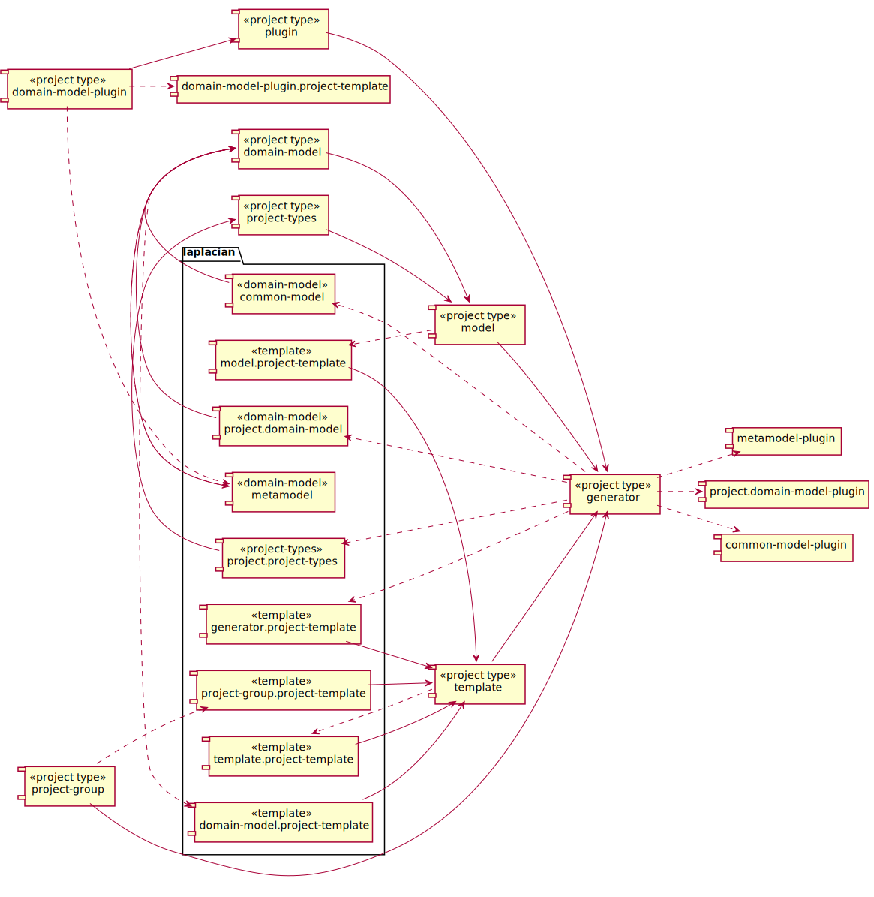

<!-- @head-content@ -->
# laplacian/projects

The core modules for the Laplacian generator.


*Read this in other languages*: [[English](README.md)] [[简体中文](README_zh.md)]
<!-- @head-content@ -->

<!-- @toc@ -->
## Table of contents
- [概要](#概要)

  * [プロジェクト依存関係](#プロジェクト依存関係)

- [使用方法](#使用方法)

- [インデックス](#インデックス)

  * [プロジェクト一覧](#プロジェクト一覧)

  * [スクリプト一覧](#スクリプト一覧)

  * [ソースコード一覧](#ソースコード一覧)


<!-- @toc@ -->

<!-- @main-content@ -->
## 概要


### プロジェクト依存関係


以下の図は、各プロジェクト間の依存関係を表したグラフです。


## 使用方法

この modelモジュールを適用するには、プロジェクト定義に以下のエントリを追加してください。
```yaml
project:
  models:
  - group: laplacian
    name: projects
    version: 1.0.0
```

下記のコマンドを実行すると、このモジュールの適用によって影響を受ける資源の一覧とその内容を確認できます。

```console
$ ./script/generate --dry-run

diff --color -r PROJECT_HOME/.NEXT/somewhere/something.md PROJECT_HOME/somewhere/something.md
1,26c1,10
< content: OLD CONTENT
---
> content: NEW CONTENT
```

内容に問題が無ければ、下記コマンドを実行して変更を反映してください。

```console
$ ./script/generate

```


## インデックス


### プロジェクト一覧


- [**laplacian/common-model**](<https://github.com/nabla-squared/laplacian.common-model.git>)

> 特定のドメインに特化していない汎用的に適用できるモデルを定義します。
> 
- [**laplacian/domain-model-plugin.project-template**](<https://github.com/nabla-squared/laplacian.domain-model-plugin.project-template.git>)

> ドメインモデルプラグインプロジェクトのテンプレートです。
> 
- [**laplacian/domain-model.project-template**](<https://github.com/nabla-squared/laplacian.domain-model.project-template.git>)

> ドメインモデルプロジェクトのディレクトリ構成、開発用スクリプト、各種ドキュメントを生成するテンプレートモジュールです。
> 
- [**laplacian/generator.project-template**](<https://github.com/nabla-squared/laplacian.generator.project-template.git>)

> このテンプレートモジュールは、Laplacianプロジェクトにおける標準的なディレクトリ構成と、ビルドおよびローカルリポジトリへの公開を行う共通的なスクリプトを生成します。
> 
- [**laplacian/metamodel**](<https://github.com/nabla-squared/laplacian.metamodel.git>)

> このモデルはモデルを定義するためのモデル(=メタモデル)です。
> このモデルでは、以下の構造を持つモデルを定義することができます。
> 
> - 属性
> - 関連
> - 集約
> - 継承
> - Mixin
> 
- [**laplacian/project-group.project-template**](<https://github.com/nabla-squared/laplacian.project-group.project-template.git>)

> プロジェクトグループ用の標準プロジェクト構成および、運用・開発用スクリプトを生成するテンプレートです。
> 
- [**laplacian/project.domain-model**](<https://github.com/nabla-squared/laplacian.project.domain-model.git>)

> このモデルは*Laplacian*プロジェクトの論理構造を表します。
> 
- [**laplacian/project.project-types**](<https://github.com/nabla-squared/laplacian.project.project-types.git>)

> 各プロジェクトタイプの内容を定義するモデルデータです。
> 
### スクリプト一覧


- [./script/create-new-domain-model-plugin-project.sh](<./scripts/create-new-domain-model-plugin-project.sh>)

  新規のdomain-model-pluginプロジェクトをこのプロジェクトグループに追加します。

  > Usage: create-new-domain-model-plugin-project.sh [OPTION]...
  >
  > -h, --help
  >
  >   このコマンドの使用方法を表示します。
  >   
  > -v, --verbose
  >
  >   より詳細なコマンドの実行情報を表示します。
  >   
  > , --project-name [VALUE]
  >
  >   新規プロジェクト名
  >   
  > , --project-version [VALUE]
  >
  >   初期バージョン番号
  >    (Default: 0.0.1)
  > , --namespace [VALUE]
  >
  >   名前空間
  >    (Default: laplacian)
- [./script/create-new-domain-model-project.sh](<./scripts/create-new-domain-model-project.sh>)

  新規のdomain-modelプロジェクトをこのプロジェクトグループに追加します。

  > Usage: create-new-domain-model-project.sh [OPTION]...
  >
  > -h, --help
  >
  >   このコマンドの使用方法を表示します。
  >   
  > -v, --verbose
  >
  >   より詳細なコマンドの実行情報を表示します。
  >   
  > , --project-name [VALUE]
  >
  >   新規プロジェクト名
  >   
  > , --project-version [VALUE]
  >
  >   初期バージョン番号
  >    (Default: 0.0.1)
  > , --namespace [VALUE]
  >
  >   名前空間
  >    (Default: laplacian)
- [./script/create-new-generator-project.sh](<./scripts/create-new-generator-project.sh>)

  新規のgeneratorプロジェクトをこのプロジェクトグループに追加します。

  > Usage: create-new-generator-project.sh [OPTION]...
  >
  > -h, --help
  >
  >   このコマンドの使用方法を表示します。
  >   
  > -v, --verbose
  >
  >   より詳細なコマンドの実行情報を表示します。
  >   
  > , --project-name [VALUE]
  >
  >   新規プロジェクト名
  >   
  > , --project-version [VALUE]
  >
  >   初期バージョン番号
  >    (Default: 0.0.1)
  > , --namespace [VALUE]
  >
  >   名前空間
  >    (Default: laplacian)
- [./script/create-new-model-project.sh](<./scripts/create-new-model-project.sh>)

  新規のmodelプロジェクトをこのプロジェクトグループに追加します。

  > Usage: create-new-model-project.sh [OPTION]...
  >
  > -h, --help
  >
  >   このコマンドの使用方法を表示します。
  >   
  > -v, --verbose
  >
  >   より詳細なコマンドの実行情報を表示します。
  >   
  > , --project-name [VALUE]
  >
  >   新規プロジェクト名
  >   
  > , --project-version [VALUE]
  >
  >   初期バージョン番号
  >    (Default: 0.0.1)
  > , --namespace [VALUE]
  >
  >   名前空間
  >    (Default: laplacian)
- [./script/create-new-plugin-project.sh](<./scripts/create-new-plugin-project.sh>)

  新規のpluginプロジェクトをこのプロジェクトグループに追加します。

  > Usage: create-new-plugin-project.sh [OPTION]...
  >
  > -h, --help
  >
  >   このコマンドの使用方法を表示します。
  >   
  > -v, --verbose
  >
  >   より詳細なコマンドの実行情報を表示します。
  >   
  > , --project-name [VALUE]
  >
  >   新規プロジェクト名
  >   
  > , --project-version [VALUE]
  >
  >   初期バージョン番号
  >    (Default: 0.0.1)
  > , --namespace [VALUE]
  >
  >   名前空間
  >    (Default: laplacian)
- [./script/create-new-project-group-project.sh](<./scripts/create-new-project-group-project.sh>)

  新規のproject-groupプロジェクトをこのプロジェクトグループに追加します。

  > Usage: create-new-project-group-project.sh [OPTION]...
  >
  > -h, --help
  >
  >   このコマンドの使用方法を表示します。
  >   
  > -v, --verbose
  >
  >   より詳細なコマンドの実行情報を表示します。
  >   
  > , --project-name [VALUE]
  >
  >   新規プロジェクト名
  >   
  > , --project-version [VALUE]
  >
  >   初期バージョン番号
  >    (Default: 0.0.1)
  > , --namespace [VALUE]
  >
  >   名前空間
  >    (Default: laplacian)
- [./script/create-new-project-types-project.sh](<./scripts/create-new-project-types-project.sh>)

  新規のproject-typesプロジェクトをこのプロジェクトグループに追加します。

  > Usage: create-new-project-types-project.sh [OPTION]...
  >
  > -h, --help
  >
  >   このコマンドの使用方法を表示します。
  >   
  > -v, --verbose
  >
  >   より詳細なコマンドの実行情報を表示します。
  >   
  > , --project-name [VALUE]
  >
  >   新規プロジェクト名
  >   
  > , --project-version [VALUE]
  >
  >   初期バージョン番号
  >    (Default: 0.0.1)
  > , --namespace [VALUE]
  >
  >   名前空間
  >    (Default: laplacian)
- [./script/create-new-template-project.sh](<./scripts/create-new-template-project.sh>)

  新規のtemplateプロジェクトをこのプロジェクトグループに追加します。

  > Usage: create-new-template-project.sh [OPTION]...
  >
  > -h, --help
  >
  >   このコマンドの使用方法を表示します。
  >   
  > -v, --verbose
  >
  >   より詳細なコマンドの実行情報を表示します。
  >   
  > , --project-name [VALUE]
  >
  >   新規プロジェクト名
  >   
  > , --project-version [VALUE]
  >
  >   初期バージョン番号
  >    (Default: 0.0.1)
  > , --namespace [VALUE]
  >
  >   名前空間
  >    (Default: laplacian)
- [./script/do-each-subproject.sh](<./scripts/do-each-subproject.sh>)

  各サブプロジェクトに対して、引数で指定されたコマンドを一括で実行します。

  使用例:
  ```console
  $ ./scripts/null -c git status
  ```

  > Usage: do-each-subproject.sh [OPTION]...
  >
  > -h, --help
  >
  >   このコマンドの使用方法を表示します。
  >   
  > -v, --verbose
  >
  >   より詳細なコマンドの実行情報を表示します。
  >   
  > -c, --continue-on-error
  >
  >   途中のサブプロジェクトで与えられたコマンドが失敗しても、残りのサブプロジェクトに対してコマンドを実行します。
  >   
- [./script/generate-all.sh](<./scripts/generate-all.sh>)

  サブプロジェクトを含むプロジェクト内の資源を自動生成します。

  > Usage: generate-all.sh [OPTION]...
  >
  > -h, --help
  >
  >   このコマンドの使用方法を表示します。
  >   
  > -v, --verbose
  >
  >   より詳細なコマンドの実行情報を表示します。
  >   
  > -c, --continue-on-error
  >
  >   途中のサブプロジェクトで与えられたコマンドが失敗しても、残りのサブプロジェクトに対してコマンドを実行します。
  >   
- [./script/generate-common-model.sh](<./scripts/generate-common-model.sh>)

  [laplacian/common-model](<https://github.com/nabla-squared/laplacian.common-model.git>)プロジェクトをサブプロジェクトとして下記のディレクトリに生成します。
  ```
  subprojects/laplacian.common-model
  ```
  すでにそのサブプロジェクトが存在する場合はその内容を更新します。

  > Usage: generate-common-model.sh [OPTION]...
  >
  > -h, --help
  >
  >   このコマンドの使用方法を表示します。
  >   
  > -v, --verbose
  >
  >   より詳細なコマンドの実行情報を表示します。
  >   
  > -c, --clean
  >
  >   サブプロジェクトのローカルにある資源を全て削除してから再生成します。
  >   
- [./script/generate-domain-model-plugin-project-template.sh](<./scripts/generate-domain-model-plugin-project-template.sh>)

  [laplacian/domain-model-plugin.project-template](<https://github.com/nabla-squared/laplacian.domain-model-plugin.project-template.git>)プロジェクトをサブプロジェクトとして下記のディレクトリに生成します。
  ```
  subprojects/laplacian.domain-model-plugin.project-template
  ```
  すでにそのサブプロジェクトが存在する場合はその内容を更新します。

  > Usage: generate-domain-model-plugin-project-template.sh [OPTION]...
  >
  > -h, --help
  >
  >   このコマンドの使用方法を表示します。
  >   
  > -v, --verbose
  >
  >   より詳細なコマンドの実行情報を表示します。
  >   
  > -c, --clean
  >
  >   サブプロジェクトのローカルにある資源を全て削除してから再生成します。
  >   
- [./script/generate-domain-model-project-template.sh](<./scripts/generate-domain-model-project-template.sh>)

  [laplacian/domain-model.project-template](<https://github.com/nabla-squared/laplacian.domain-model.project-template.git>)プロジェクトをサブプロジェクトとして下記のディレクトリに生成します。
  ```
  subprojects/laplacian.domain-model.project-template
  ```
  すでにそのサブプロジェクトが存在する場合はその内容を更新します。

  > Usage: generate-domain-model-project-template.sh [OPTION]...
  >
  > -h, --help
  >
  >   このコマンドの使用方法を表示します。
  >   
  > -v, --verbose
  >
  >   より詳細なコマンドの実行情報を表示します。
  >   
  > -c, --clean
  >
  >   サブプロジェクトのローカルにある資源を全て削除してから再生成します。
  >   
- [./script/generate-generator-project-template.sh](<./scripts/generate-generator-project-template.sh>)

  [laplacian/generator.project-template](<https://github.com/nabla-squared/laplacian.generator.project-template.git>)プロジェクトをサブプロジェクトとして下記のディレクトリに生成します。
  ```
  subprojects/laplacian.generator.project-template
  ```
  すでにそのサブプロジェクトが存在する場合はその内容を更新します。

  > Usage: generate-generator-project-template.sh [OPTION]...
  >
  > -h, --help
  >
  >   このコマンドの使用方法を表示します。
  >   
  > -v, --verbose
  >
  >   より詳細なコマンドの実行情報を表示します。
  >   
  > -c, --clean
  >
  >   サブプロジェクトのローカルにある資源を全て削除してから再生成します。
  >   
- [./script/generate-metamodel.sh](<./scripts/generate-metamodel.sh>)

  [laplacian/metamodel](<https://github.com/nabla-squared/laplacian.metamodel.git>)プロジェクトをサブプロジェクトとして下記のディレクトリに生成します。
  ```
  subprojects/laplacian.metamodel
  ```
  すでにそのサブプロジェクトが存在する場合はその内容を更新します。

  > Usage: generate-metamodel.sh [OPTION]...
  >
  > -h, --help
  >
  >   このコマンドの使用方法を表示します。
  >   
  > -v, --verbose
  >
  >   より詳細なコマンドの実行情報を表示します。
  >   
  > -c, --clean
  >
  >   サブプロジェクトのローカルにある資源を全て削除してから再生成します。
  >   
- [./script/generate-project-domain-model.sh](<./scripts/generate-project-domain-model.sh>)

  [laplacian/project.domain-model](<https://github.com/nabla-squared/laplacian.project.domain-model.git>)プロジェクトをサブプロジェクトとして下記のディレクトリに生成します。
  ```
  subprojects/laplacian.project.domain-model
  ```
  すでにそのサブプロジェクトが存在する場合はその内容を更新します。

  > Usage: generate-project-domain-model.sh [OPTION]...
  >
  > -h, --help
  >
  >   このコマンドの使用方法を表示します。
  >   
  > -v, --verbose
  >
  >   より詳細なコマンドの実行情報を表示します。
  >   
  > -c, --clean
  >
  >   サブプロジェクトのローカルにある資源を全て削除してから再生成します。
  >   
- [./script/generate-project-group-project-template.sh](<./scripts/generate-project-group-project-template.sh>)

  [laplacian/project-group.project-template](<https://github.com/nabla-squared/laplacian.project-group.project-template.git>)プロジェクトをサブプロジェクトとして下記のディレクトリに生成します。
  ```
  subprojects/laplacian.project-group.project-template
  ```
  すでにそのサブプロジェクトが存在する場合はその内容を更新します。

  > Usage: generate-project-group-project-template.sh [OPTION]...
  >
  > -h, --help
  >
  >   このコマンドの使用方法を表示します。
  >   
  > -v, --verbose
  >
  >   より詳細なコマンドの実行情報を表示します。
  >   
  > -c, --clean
  >
  >   サブプロジェクトのローカルにある資源を全て削除してから再生成します。
  >   
- [./script/generate-project-project-types.sh](<./scripts/generate-project-project-types.sh>)

  [laplacian/project.project-types](<https://github.com/nabla-squared/laplacian.project.project-types.git>)プロジェクトをサブプロジェクトとして下記のディレクトリに生成します。
  ```
  subprojects/laplacian.project.project-types
  ```
  すでにそのサブプロジェクトが存在する場合はその内容を更新します。

  > Usage: generate-project-project-types.sh [OPTION]...
  >
  > -h, --help
  >
  >   このコマンドの使用方法を表示します。
  >   
  > -v, --verbose
  >
  >   より詳細なコマンドの実行情報を表示します。
  >   
  > -c, --clean
  >
  >   サブプロジェクトのローカルにある資源を全て削除してから再生成します。
  >   
- [./script/generate.sh](<./scripts/generate.sh>)

  このプロジェクト内の資源を自動生成します。
  `src/` `model/` `template/` の各ディレクトリに格納された資源をもとに自動生成を行い、その結果を`dest/` `doc/` `script/` の各ディレクトリに反映します。

  *自動生成入力ファイル*

  - `src/`
    自動生成の対象とならない静的な資源を格納します。
    このディレクトリの内容は `dest/` 配下にそのままコピーされます。

  - `model/`
    自動生成で使用されるYAMLもしくはJSON形式で記述された静的なモデルデータを格納します。

  - `template/`
    自動生成で使用されるテンプレートファイルを格納します。ファイル拡張子に `.hbs` を含むファイルがテンプレートして扱われます。
    それ以外のファイルはそのままコピーされます。

    - `template/dest` `template/doc` `template/scripts`
      これらのディレクトリはそれぞれ、`dest/` `doc/` `scripts`の各ディレクトリに出力される資源のテンプレートを格納します。

    - `template/model` `template/template`
      自動生成で使用される`template/` `model/`の内容を更新するためのテンプレートを格納します。
      自動生成の結果、`template/` `model/` の内容が更新された場合は、自動生成処理を再帰的に実行します。
      なお、上記処理中に発生した`template/` `model/`への変更は、中間状態として扱われるため、処理完了後は失われます。
      これらの中間ファイルを確認するためには *--dry-run* オプションを使用してください。

  *自動生成結果ファイル*

  - `dest/`
    自動生成の結果作成されるアプリケーションやモジュールのソースファイル等を出力します。

  - `doc/`
    プロジェクトのドキュメントを出力します。

  - `scripts/`
    開発・運用で使用する各種スクリプトを出力します。

  > Usage: generate.sh [OPTION]...
  >
  > -h, --help
  >
  >   このコマンドの使用方法を表示します。
  >   
  > -v, --verbose
  >
  >   より詳細なコマンドの実行情報を表示します。
  >   
  > -d, --dry-run
  >
  >   自動生成処理を実行後、生成されたファイルを`dest/` `doc/` `scripts/`の各フォルダに反映せずに、`.NEXT`ディレクトリに出力します。
  >   また、`.NEXT`ディレクトリの内容と現在のファイルの差異を出力します。
  >   このディレクトリには自動生成中に作成された中間ファイルも含まれます。
  >   
  > -r, --max-recursion [VALUE]
  >
  >   自動生成処理中に`model/` `template/`ディレクトリの内容が更新された場合に、
  >   再帰的に自動生成処理を実行する回数の上限。
  >    (Default: 10)
  > , --local-module-repository [VALUE]
  >
  >   ローカルでビルドされたモジュールを格納するリポジトリのパス。
  >   ここに存在するモジュールが最優先で参照される。
  >   
- [./script/git-each-subproject.sh](<./scripts/git-each-subproject.sh>)

  各サブプロジェクトに対して、引数で指定されたGitサブコマンドを一括実行します。

  使用例:
  ```console
  $ ./scripts/null -c status
  ```

  > Usage: git-each-subproject.sh [OPTION]...
  >
  > -h, --help
  >
  >   このコマンドの使用方法を表示します。
  >   
  > -v, --verbose
  >
  >   より詳細なコマンドの実行情報を表示します。
  >   
  > -c, --continue-on-error
  >
  >   途中のサブプロジェクトで与えられたコマンドが失敗しても、残りのサブプロジェクトに対してコマンドを実行します。
  >   
- [./script/publish-local.sh](<./scripts/publish-local.sh>)

  プロジェクト内の資源を自動生成した後、ディレクトリにある資源をモデルモジュールとしてビルドし、
  ローカルリポジトリに登録します。

  > Usage: publish-local.sh [OPTION]...
  >
  > -h, --help
  >
  >   このコマンドの使用方法を表示します。
  >   
  > -v, --verbose
  >
  >   より詳細なコマンドの実行情報を表示します。
  >   
  > -r, --max-recursion [VALUE]
  >
  >   [generate.sh](<./scripts/generate.sh>)の同名のオプションと同じものです。
  >    (Default: 10)
  > , --skip-generation
  >
  >   自動生成処理を行わずに、ビルドおよびローカルリポジトリへの登録を行います。
  >   
  > , --local-module-repository [VALUE]
  >
  >   ビルドしたモジュールを格納するローカルリポジトリのパス。
  >   指定したパスにリポジトリが存在しない場合は、自動的に作成されます。
  >   
- [./script/publish-local-common-model.sh](<./scripts/publish-local-common-model.sh>)

  [laplacian/common-model](<https://github.com/nabla-squared/laplacian.common-model.git>)サブプロジェクトの資源を自動生成します。

  > Usage: publish-local-common-model.sh [OPTION]...
  >
  > -h, --help
  >
  >   このコマンドの使用方法を表示します。
  >   
  > -v, --verbose
  >
  >   より詳細なコマンドの実行情報を表示します。
  >   
- [./script/publish-local-domain-model-plugin-project-template.sh](<./scripts/publish-local-domain-model-plugin-project-template.sh>)

  [laplacian/domain-model-plugin.project-template](<https://github.com/nabla-squared/laplacian.domain-model-plugin.project-template.git>)サブプロジェクトの資源を自動生成します。

  > Usage: publish-local-domain-model-plugin-project-template.sh [OPTION]...
  >
  > -h, --help
  >
  >   このコマンドの使用方法を表示します。
  >   
  > -v, --verbose
  >
  >   より詳細なコマンドの実行情報を表示します。
  >   
- [./script/publish-local-domain-model-project-template.sh](<./scripts/publish-local-domain-model-project-template.sh>)

  [laplacian/domain-model.project-template](<https://github.com/nabla-squared/laplacian.domain-model.project-template.git>)サブプロジェクトの資源を自動生成します。

  > Usage: publish-local-domain-model-project-template.sh [OPTION]...
  >
  > -h, --help
  >
  >   このコマンドの使用方法を表示します。
  >   
  > -v, --verbose
  >
  >   より詳細なコマンドの実行情報を表示します。
  >   
- [./script/publish-local-generator-project-template.sh](<./scripts/publish-local-generator-project-template.sh>)

  [laplacian/generator.project-template](<https://github.com/nabla-squared/laplacian.generator.project-template.git>)サブプロジェクトの資源を自動生成します。

  > Usage: publish-local-generator-project-template.sh [OPTION]...
  >
  > -h, --help
  >
  >   このコマンドの使用方法を表示します。
  >   
  > -v, --verbose
  >
  >   より詳細なコマンドの実行情報を表示します。
  >   
- [./script/publish-local-metamodel.sh](<./scripts/publish-local-metamodel.sh>)

  [laplacian/metamodel](<https://github.com/nabla-squared/laplacian.metamodel.git>)サブプロジェクトの資源を自動生成します。

  > Usage: publish-local-metamodel.sh [OPTION]...
  >
  > -h, --help
  >
  >   このコマンドの使用方法を表示します。
  >   
  > -v, --verbose
  >
  >   より詳細なコマンドの実行情報を表示します。
  >   
- [./script/publish-local-project-domain-model.sh](<./scripts/publish-local-project-domain-model.sh>)

  [laplacian/project.domain-model](<https://github.com/nabla-squared/laplacian.project.domain-model.git>)サブプロジェクトの資源を自動生成します。

  > Usage: publish-local-project-domain-model.sh [OPTION]...
  >
  > -h, --help
  >
  >   このコマンドの使用方法を表示します。
  >   
  > -v, --verbose
  >
  >   より詳細なコマンドの実行情報を表示します。
  >   
- [./script/publish-local-project-group-project-template.sh](<./scripts/publish-local-project-group-project-template.sh>)

  [laplacian/project-group.project-template](<https://github.com/nabla-squared/laplacian.project-group.project-template.git>)サブプロジェクトの資源を自動生成します。

  > Usage: publish-local-project-group-project-template.sh [OPTION]...
  >
  > -h, --help
  >
  >   このコマンドの使用方法を表示します。
  >   
  > -v, --verbose
  >
  >   より詳細なコマンドの実行情報を表示します。
  >   
- [./script/publish-local-project-project-types.sh](<./scripts/publish-local-project-project-types.sh>)

  [laplacian/project.project-types](<https://github.com/nabla-squared/laplacian.project.project-types.git>)サブプロジェクトの資源を自動生成します。

  > Usage: publish-local-project-project-types.sh [OPTION]...
  >
  > -h, --help
  >
  >   このコマンドの使用方法を表示します。
  >   
  > -v, --verbose
  >
  >   より詳細なコマンドの実行情報を表示します。
  >   
### ソースコード一覧


- [model/project.yaml](<./model/project.yaml>)
- [src/project/subprojects/laplacian/laplacian.common-model.yaml](<./src/project/subprojects/laplacian/laplacian.common-model.yaml>)
- [src/project/subprojects/laplacian/laplacian.domain-model-plugin.project-template.yaml](<./src/project/subprojects/laplacian/laplacian.domain-model-plugin.project-template.yaml>)
- [src/project/subprojects/laplacian/laplacian.domain-model.project-template.yaml](<./src/project/subprojects/laplacian/laplacian.domain-model.project-template.yaml>)
- [src/project/subprojects/laplacian/laplacian.generator.project-template.yaml](<./src/project/subprojects/laplacian/laplacian.generator.project-template.yaml>)
- [src/project/subprojects/laplacian/laplacian.metamodel.yaml](<./src/project/subprojects/laplacian/laplacian.metamodel.yaml>)
- [src/project/subprojects/laplacian/laplacian.project.domain-model.yaml](<./src/project/subprojects/laplacian/laplacian.project.domain-model.yaml>)
- [src/project/subprojects/laplacian/laplacian.project-group.project-template.yaml](<./src/project/subprojects/laplacian/laplacian.project-group.project-template.yaml>)
- [src/project/subprojects/laplacian/laplacian.project.project-types.yaml](<./src/project/subprojects/laplacian/laplacian.project.project-types.yaml>)


<!-- @main-content@ -->